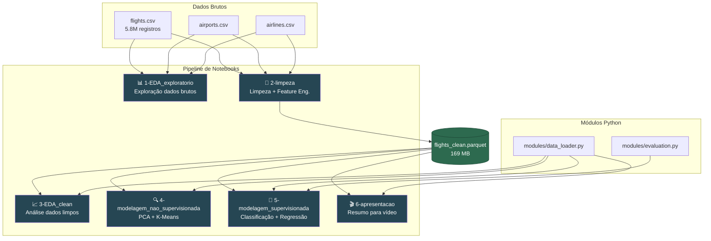

# ✈️ Flight Delay Prediction

> Previsão de atrasos em voos domésticos dos EUA utilizando Machine Learning supervisionado e não supervisionado.

[](https://www.python.org/)
[](https://scikit-learn.org/)
[](https://xgboost.readthedocs.io/)
[](https://lightgbm.readthedocs.io/)
[](https://jupyter.org/)
[](https://docs.astral.sh/uv/)

---

## 📋 Sobre o Projeto

Projeto acadêmico desenvolvido para a **Pós-Graduação em Machine Learning Engineering (Fase 3 — Tech Challenge)**.

O objetivo é aplicar técnicas de ciência de dados e machine learning ao dataset público [Flight Delays and Cancellations](https://www.kaggle.com/datasets/usdot/flight-delays) do **US Department of Transportation (2015)**, contendo **~5,8 milhões de registros** de voos domésticos nos Estados Unidos.

### Autor

| | |
|---|---|
| **Nome** | Vitor Paixão |
| **Email** | vitor@vitorpaixao.com |
| **RM** | 367078 |

---

## 🎯 Objetivos

| Requisito | Status | Notebook |
|-----------|--------|----------|
| EDA com estatísticas descritivas e visualizações | ✅ | `1-EDA_exploratorio.ipynb` / `3-EDA_clean.ipynb` |
| Tratamento de valores ausentes | ✅ | `2-limpeza.ipynb` |
| Modelagem supervisionada (2+ algoritmos) | ✅ | `5-modelagem_supervisionada.ipynb` |
| Modelagem não supervisionada | ✅ | `4-modelagem_nao_supervisionada.ipynb` |
| Apresentação crítica dos resultados | ✅ | `6-apresentacao.ipynb` |
| Feature engineering (variáveis derivadas) | ✅ | `2-limpeza.ipynb` |
| Análise por aeroporto, companhia e estado | ✅ | `1-EDA_exploratorio.ipynb` / `3-EDA_clean.ipynb` |
| Padrões sazonais e horários críticos | ✅ | `1-EDA_exploratorio.ipynb` |

---

## 🏗️ Arquitetura do Projeto



### Estrutura de Arquivos

```
flight-delay-prediction/
├── 📁 data/
│   ├── flights.csv                  # ~5.8M voos (não versionado)
│   ├── airports.csv                 # Metadados dos aeroportos
│   ├── airlines.csv                 # Códigos das companhias
│   └── flights_clean.parquet        # Dataset limpo (gerado por 2-limpeza)
│
├── 📁 modules/
│   ├── __init__.py
│   ├── data_loader.py               # Carrega Parquet, constrói splits
│   └── evaluation.py                # Métricas e plots de avaliação
│
├── 📁 notebooks/
│   ├── 1-EDA_exploratorio.ipynb     # EDA dados brutos
│   ├── 2-limpeza.ipynb              # Pipeline de limpeza → Parquet
│   ├── 3-EDA_clean.ipynb            # EDA dados limpos
│   ├── 4-modelagem_nao_supervisionada.ipynb  # PCA + K-Means
│   ├── 5-modelagem_supervisionada.ipynb      # Classificação + Regressão
│   └── 6-apresentacao.ipynb         # Resumo para apresentação
│
├── 📁 plan/
│   ├── dic_data.md                  # Dicionário de dados
│   ├── tech_challenge.md            # Requisitos do Tech Challenge
│   └── origin/                      # PDFs originais
│
├── pyproject.toml                   # Dependências (uv)
├── uv.lock                         # Lock de versões
└── .gitignore
```

---

## 📖 Sequência de Leitura dos Notebooks

Os notebooks são **numerados na ordem de execução**. Siga esta sequência:


| # | Notebook | Descrição | Entrada | Saída |
|:-:|----------|-----------|---------|-------|
| 1 | **`1-EDA_exploratorio.ipynb`** | Exploração dos dados brutos: joins, missing values (4 padrões), distribuições, atrasos por companhia/mês/hora, top aeroportos, correlações | CSVs brutos | Insights e decisões de limpeza |
| 2 | **`2-limpeza.ipynb`** | Pipeline de limpeza completo: drops, filtros, imputação, feature engineering | CSVs brutos | `flights_clean.parquet` (169 MB) |
| 3 | **`3-EDA_clean.ipynb`** | Análise dos dados limpos: distribuições das features, balance de classes, padrões temporais/geográficos, verificação da feature matrix | Parquet | Validação pré-modelagem |
| 4 | **`4-modelagem_nao_supervisionada.ipynb`** | PCA nas causas de atraso + K-Means em perfis de aeroporto | Parquet | Clusters e componentes |
| 5 | **`5-modelagem_supervisionada.ipynb`** | Classificação (LR vs XGBoost) + Regressão (LinReg vs LightGBM vs XGBoost) — 5 modelos | Parquet | Métricas comparativas |
| 6 | **`6-apresentacao.ipynb`** | Resumo executivo para vídeo de apresentação (5-10 min) | Parquet | Slides e gráficos-chave |

> **Importante**: O notebook `2-limpeza.ipynb` **deve ser executado antes** dos notebooks 3-6, pois gera o arquivo `flights_clean.parquet` que os demais consomem.

---

## 🧹 Pipeline de Limpeza

O notebook `2-limpeza.ipynb` transforma os dados brutos em dados prontos para modelagem:

| Etapa | Operação | Registros | Justificativa |
|:-----:|----------|:---------:|---------------|
| 0 | Dados brutos + joins | 5.819.079 | 3 CSVs unificados via left join |
| 1 | `drop(YEAR, TAIL_NUMBER, FLIGHT_NUMBER)` | 5.819.079 | Constante (YEAR) e identificadores de alta cardinalidade |
| 2 | Remover cancelados (`CANCELLED == 0`) | 5.729.195 | Cancelados ≠ atrasados (-89.884 voos) |
| 3 | `fillna(0)` nas 5 causas de atraso | 5.729.195 | NaN = "sem atraso desta causa" (by design) |
| 4 | `dropna(DEPARTURE_DELAY)` | 5.729.195 | Sem dados faltantes após filtro de cancelados |
| 5 | `fillna("Desconhecido")` cols de join | 5.729.195 | ~8,3% aeroportos com código FAA sem match IATA |
| 6 | Feature engineering | 5.729.195 | DEP_HOUR, SEASON, IS_WEEKEND, IS_DELAYED |
| 7 | Export Parquet | 5.729.195 × 41 | Compressão snappy → 169 MB |

---

## 🤖 Modelos Implementados

### Classificação — `IS_DELAYED` (atraso > 15 min)

| Modelo | Tipo | Tratamento de Imbalance | Destaque |
|--------|------|------------------------|----------|
| **Regressão Logística** | Baseline linear | `class_weight='balanced'` | Interpretável, coeficientes |
| **XGBoost Classifier** | Gradient Boosting | `scale_pos_weight=4.6` | Não-linearidades, feature importance |

### Regressão — `DEPARTURE_DELAY` (minutos, delay > 0)

| Modelo | Tipo | Destaque |
|--------|------|----------|
| **Regressão Linear** | Baseline linear | Interpretável |
| **LightGBM Regressor** | Gradient Boosting (histogram) | 2-3x mais rápido que XGBoost |
| **XGBoost Regressor** | Gradient Boosting | Comparação direta com LightGBM |

### Não Supervisionada

| Técnica | Aplicação | Objetivo |
|---------|-----------|----------|
| **PCA** | 5 causas de atraso | Encontrar eixos principais de variação |
| **K-Means** | Perfis de aeroporto | Agrupar aeroportos com comportamento similar |

### Features utilizadas (20)

```
Numéricas (6):  MONTH, DAY_OF_WEEK, DEP_HOUR, SEASON, IS_WEEKEND, DISTANCE
Categóricas (14): AIRLINE_AA, AIRLINE_AS, ..., AIRLINE_WN  (one-hot encoding)
```

---

## 📊 Dataset

| Aspecto | Detalhe |
|---------|---------|
| **Fonte** | US Department of Transportation |
| **Período** | Janeiro – Dezembro 2015 |
| **Registros brutos** | 5.819.079 voos |
| **Registros limpos** | 5.729.195 voos (98,5%) |
| **Companhias** | 14 carriers |
| **Aeroportos** | 322+ aeroportos de origem |
| **Target (classificação)** | `IS_DELAYED` = `DEPARTURE_DELAY > 15 min` |
| **Balance de classes** | 82,3% pontuais / 17,7% atrasados |

---

## 🚀 Como Executar

### Pré-requisitos

- **Python 3.13+**
- **[uv](https://docs.astral.sh/uv/)** (gerenciador de pacotes)
- **Dados**: os 3 CSVs devem estar em `data/` ([download no Kaggle](https://www.kaggle.com/datasets/usdot/flight-delays))

### 1. Instalar o uv

**Windows (PowerShell):**
```powershell
powershell -ExecutionPolicy ByPass -c "irm https://astral.sh/uv/install.ps1 | iex"
```

**Linux / macOS:**
```bash
curl -LsSf https://astral.sh/uv/install.sh | sh
```

### 2. Instalar dependências

```bash
uv sync --group dev
```

### 3. Registrar kernel do Jupyter

```bash
uv run python -m ipykernel install --user --name flight-delay-prediction --display-name "Flight Delay Prediction"
```

### 4. Iniciar JupyterLab

```bash
uv run jupyter lab
```

### 5. Executar notebooks na ordem

```
1-EDA_exploratorio  →  2-limpeza  →  3-EDA_clean  →  4/5 (qualquer ordem)  →  6-apresentacao
```

> **Nota**: O notebook `2-limpeza` gera o arquivo `flights_clean.parquet` (~169 MB). Os notebooks 3-6 dependem deste arquivo.

---

## 🔧 Stack Tecnológica

| Categoria | Tecnologias |
|-----------|-------------|
| **Linguagem** | Python 3.13 |
| **Gerenciamento** | uv, pyproject.toml |
| **Dados** | pandas, numpy, pyarrow |
| **Visualização** | matplotlib, seaborn |
| **ML Supervisionado** | scikit-learn, XGBoost, LightGBM |
| **ML Não Supervisionado** | scikit-learn (PCA, K-Means) |
| **Ambiente** | JupyterLab, ipykernel |

---

## 📁 Módulos Auxiliares

### `modules/data_loader.py`

| Função | Descrição |
|--------|-----------|
| `load_flights_clean()` | Carrega o Parquet limpo |
| `build_classification_split(df)` | Retorna X/y train/test para IS_DELAYED (20 features, split 80/20) |
| `build_regression_split(df)` | Retorna X/y train/test para DEPARTURE_DELAY > 0 |

### `modules/evaluation.py`

| Função | Descrição |
|--------|-----------|
| `print_classification_report()` | Accuracy, Precision, Recall, F1, ROC-AUC |
| `plot_confusion_matrix()` | Heatmap da confusion matrix |
| `plot_roc_curves()` | Curvas ROC sobrepostas |
| `print_regression_report()` | MAE, RMSE, R² |
| `plot_residuals()` | Scatter de resíduos |
| `plot_feature_importance()` | Top features (compatível sklearn/xgboost/lightgbm) |

---

## ⚠️ Limitações

- **Temporal**: dataset de 2015 apenas — sem validação de generalização para outros anos
- **Features**: apenas informações pré-partida, sem dados meteorológicos ou operacionais em tempo real
- **Imbalance**: 82/18 — modelos tendem ao viés da classe majoritária
- **Outliers**: <1% dos voos com atrasos extremos (>300 min) afetam métricas de regressão
- **Geográfico**: ~8,3% dos aeroportos sem metadados completos

---

## 📄 Licença

Projeto acadêmico — uso educacional.

---

<p align="center">
  <i>Desenvolvido por <b>Vitor Paixão</b> (RM 367078) — Pós-Graduação, Fase 3: Machine Learning Engineering</i>
</p>
